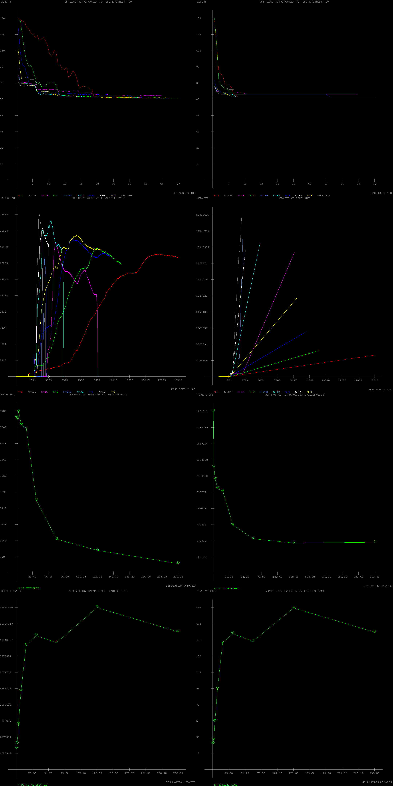
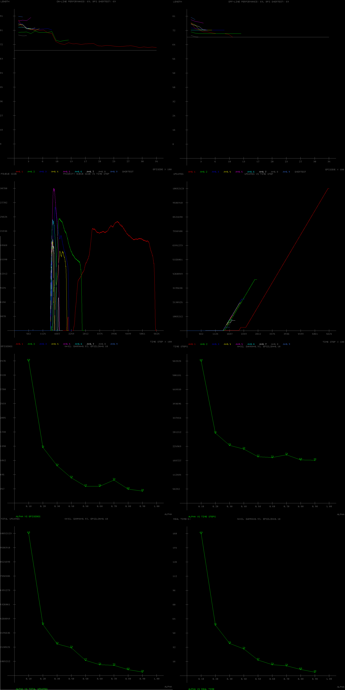
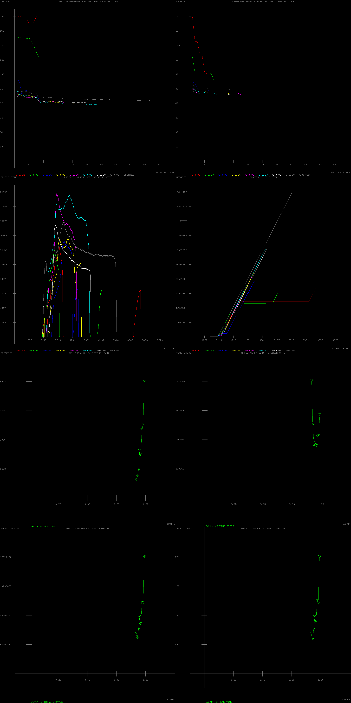
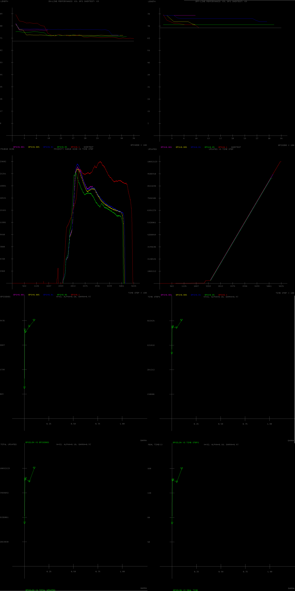

# Rod Maneuvering

Prioritized Sweeping via Reinforcement Learning

Implemented in Lua

Below are some comparison charts for different parameters ranges. "Simulation Updates" states for n parameter. All the parameters are generally fixed to "n=32, Alpha=0.1, Gamma=0.97, Epsilon=0.1". In each scenarion one of the parameter is allowed to take different values in a range while the others stay fixed to their original value.

